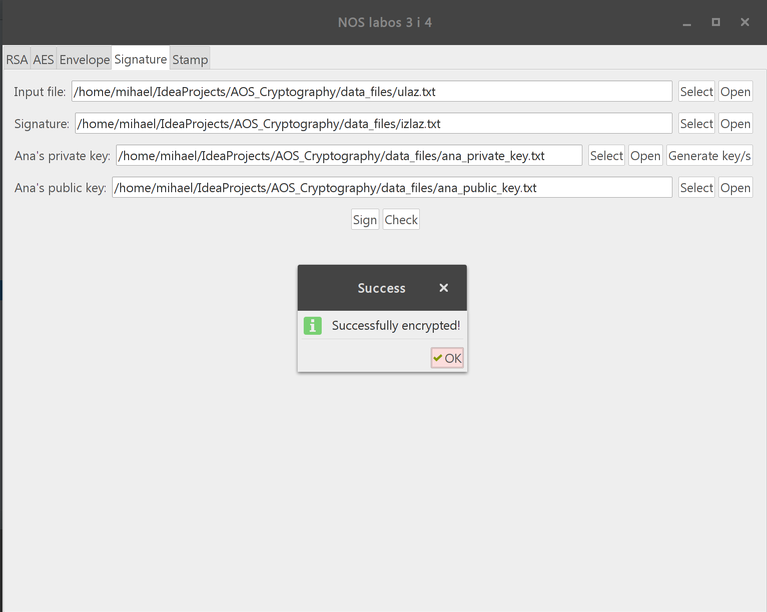

# AOS-Cryptography
## (Napredni operacijski sustavi 3. i 4. laboratorijska vježba)

## Info
### Links:
* <a href="http://www.fer.unizg.hr">Fakultet elektrotehnike i računarstva</a>
* <a href="http://www.fer.unizg.hr/predmet/nos">Napredni operacijski sustavi</a>

# About
(c) 2017 Mihael Nikić

*Verzija 1.0*

Datum: **03.05.2017.** 

##Opis projekta:
* Program kriptira/dekriptira datoteke pomoću simetričnog algoritma (AES) i asimetričnog algoritma (RSA), stvara njihov sažetak pomoću algoritma sažimanja (SHA-2), i stvara digitalnu omotnicu i digitalni pečat.

* Detaljnije na <a href="http://www.zemris.fer.hr/predmeti/os2/">OS2</a>

* Java & Swing

 

 

 

 

